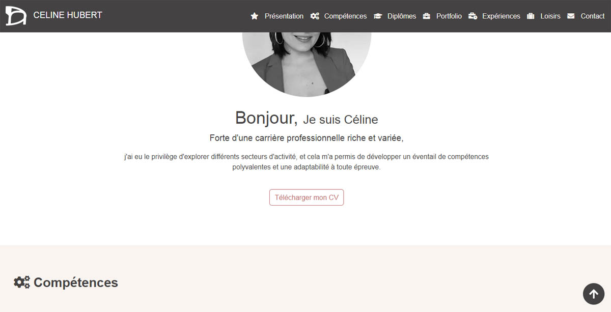

# chubert-portfoliocv



# Portfolio CV de Céline Hubert

Bienvenue sur mon portfolio-cv en ligne, créé avec l'aide de ChatGPT 3.5. Ce projet constitue mon premier site web, où je présente ma carrière professionnelle, mes compétences, mes diplômes, mon portfolio créatif, mon expérience professionnelle, mes loisirs, et comment les visiteurs peuvent me contacter.

## Sommaire

1. [Présentation de ma Carrière Professionnelle](#présentation-de-ma-carrière-professionnelle)
2. [Compétences](#compétences)
3. [Diplômes](#diplômes)
4. [Portfolio Créatif](#portfolio-créatif)
5. [Expérience Professionnelle](#expérience-professionnelle)
6. [Loisirs](#loisirs)
7. [Contact](#contact)
8. [Structure du Projet](#structure-du-projet)
9. [Contenu du Projet](#contenu-du-projet)
10. [Langages de Programmation et Framework](#langages-de-programmation-et-framework)
11. [Informations Supplémentaires](#informations-supplémentaires)
12. [Remerciements](#remerciements)

## Présentation
- [**cv-celine-hubert.pdf:**](presentation/cv-celine-hubert.pdf) Téléchargez mon CV au format PDF.
- [**photo-professionnelle-celine-hubert.jpg:**](presentation/photo-professionnelle-celine-hubert.jpg) Photo professionnelle.

### Barres de Progression pour les Compétences humaines, créatives et techniques

Pour consulter l'intégralité de mes compétences et en savoir plus sur mon parcours académique, veuillez visiter la section correspondante sur [mon site portfolio](https://celinahub.github.io).

## Diplômes

1. **CAP AEPE**
   - Candidat libre, Juin 2020

2. **BAC+3 stylisme / modélisme option textile**
   - LISAA Paris, 2007

3. **BAC PRO Artisanat et métiers d'Art**
   - Lycée immaculée conception Laval, 2004

4. **CAP Prêt-à-porter**
   - Lycée immaculée conception Laval, 2003

5. **BEP Métiers de la mode et des industries connexes**
   - Lycée immaculée conception Laval, 2002

## Portfolio Créatif

### Carré Soie Céline Hubert motif identité visuelle du logo ch
- Motif Graphique de mon logo ch en Noir et Blanc
- Motif Graphique de mon logo ch en couleur
- Motif Place de mon logo ch dupliqué Floral Noir et Blanc
- Motif Place de mon logo ch dupliqué Floral en couleur

### Conception Logo Céline Hubert
- Étapes 1 à 15 du processus de conception.

### Découvrir CH
- Allover Monogramme
- Monogramme
- Sac avec Logo
- Sneakers (Photos variées)

### Dossier Technique
- Descriptif du projet
- Mesures et dimensions
- Photos détaillées des poches brodées

### Texte Démarche Créative Logo CH
- À propos du projet
- Dossier technique
- Monogramme détaillé

## Expérience Professionnelle

1. **Assistante maternelle agréée**
   - Indépendante, 2017 à aujourd'hui

2. **Assistante styliste-infographiste**
   - CDI, Juin 2012-Oct 2016

3. **Infographiste-SUN CITY GROUP**
   - CDD, Avr2011-Avr2012

## Loisirs

1. **Développement web**
   
2. **Illustration**
   
3. **Shopping**
   
4. **Décoration intérieure**

5. **Bricolage**

6. **Couture**


## Structure du Projet

```bash
chubert-portfoliocv/
|   |-- index.html
|   |-- style.css
|   |-- images/
|       |-- loisirs/
|           |-- bricolage.jpg
|           |-- couture.jpg
|           |-- decoration-interieure.jpg
|           |-- dessin-encre-de-chine.jpg
|           |-- developpement-web.jpg
|           |-- shopping.jpg
|       |-- portfolio/
|           |-- carre-soie-celine-hubert/
|               |-- motif-graphique-floral-couleur.jpg
|               |-- motif-graphique-floral-noir-blanc.jpg
|               |-- motif-place-floral-couleur.jpg
|               |-- motif-place-floral-noir-blanc.jpg
|           |-- conception-logo-celine-hubert/
|               |-- etape-1-logo-celine-hubert-ch.jpg
|               |-- etape-2-logo-celine-hubert-ch.jpg
|               |-- etape-3-logo-celine-hubert-ch.jpg
|               |-- etape-4-logo-celine-hubert-ch.jpg
|               |-- etape-5-logo-celine-hubert-ch.jpg
|               |-- etape-6-logo-celine-hubert-ch.jpg
|               |-- etape-7-logo-celine-hubert-ch.jpg
|               |-- etape-8-logo-celine-hubert-ch.jpg
|               |-- etape-9-logo-celine-hubert-ch.jpg
|               |-- etape-10-logo-celine-hubert-ch.jpg
|               |-- etape-11-logo-celine-hubert-ch.jpg
|               |-- etape-12-logo-celine-hubert-ch.jpg
|               |-- etape-13-logo-celine-hubert-ch.jpg
|               |-- etape-14-logo-celine-hubert-ch.jpg
|               |-- etape-15-logo-celine-hubert-ch.jpg
|           |-- decouvrir-ch/
|               |-- allover-monogramme.jpg
|               |-- monogramme.png
|               |-- sac-logo.jpg
|               |-- sneakers.jpg
|               |-- sneakers2.jpg
|           |-- dossier-technique/
|               |-- descriptif.jpg
|               |-- mesures.jpg
|               |-- poches-broderie.jpg
|               |-- zoom-poche-devant.jpg
|               |-- zoom-poche-dos.jpg
|           |-- texte-demarche-creative-logo-ch/
|               |-- a-propos.jpg
|               |-- dossier-technique.jpg
|               |-- monogramme-ch.jpg
|   |-- presentation/
|       |-- cv-celine-hubert.pdf
|       |-- photo-professionnelle-celine-hubert.jpg
|   |-- mon-logo.png
|-- README.md
|-- robots.txt
```


## Contenu du Projet

Le projet est structuré comme suit :

- **index.html:** Fichier principal du site web.
- **style.css:** Feuille de style pour la mise en page.
- **images/:** Répertoire contenant des images utilisées dans le site.
  - **loisirs/:** Images liées à mes loisirs.
  - **portfolio/:** Images de mes projets artistiques.
- **presentation/:** Dossier contenant des éléments de présentation.
  - **cv-celine-hubert.pdf:** Mon curriculum vitae au format PDF.
  - **photo-professionnelle-celine-hubert.jpg:** Photo professionnelle.

- **mon-logo.png:** Image de mon logo personnel.

### Langages de Programmation
- HTML5
- CSS3
- JavaScript

### Framework
- Bootstrap 5


## Informations Supplémentaires

- **README.md:** Vous êtes ici ! Un guide rapide sur le projet.
- **robots.txt:** Fichier pour la gestion des robots d'exploration.


### Remerciements
N'hésitez pas à explorer les différents répertoires pour découvrir mes projets artistiques, mon parcours professionnel, et en apprendre davantage sur moi.
Merci d'avoir visité mon portfolio ! N'hésitez pas à me contacter pour toute question ou opportunité.

---
**Céline Hubert**


